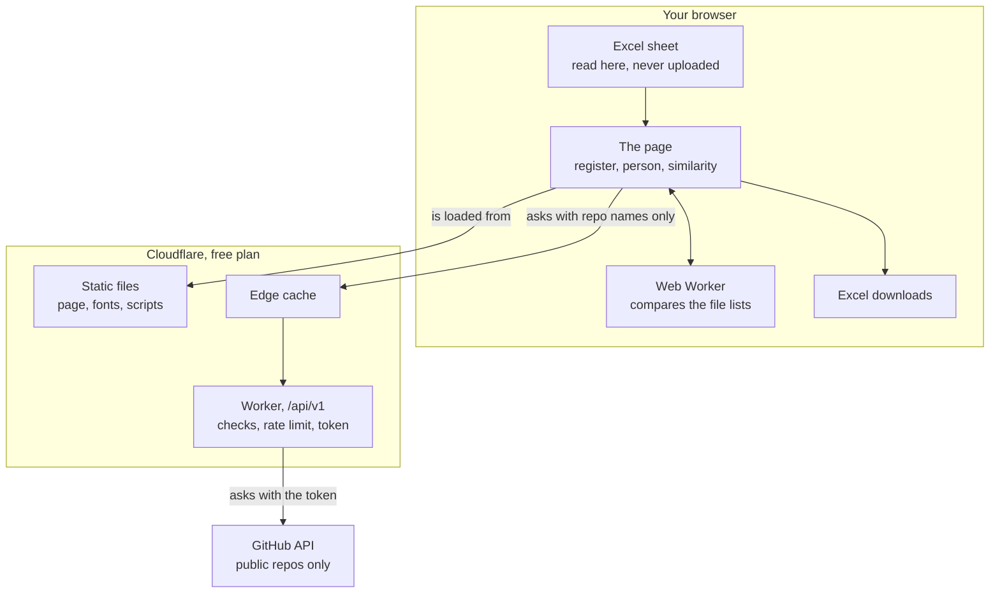
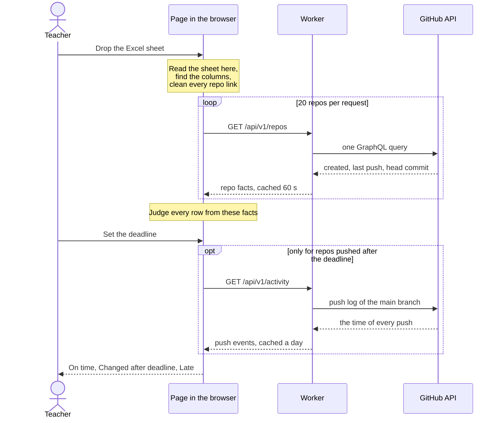
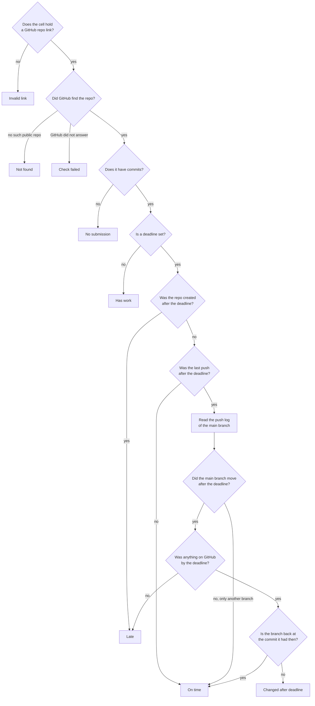
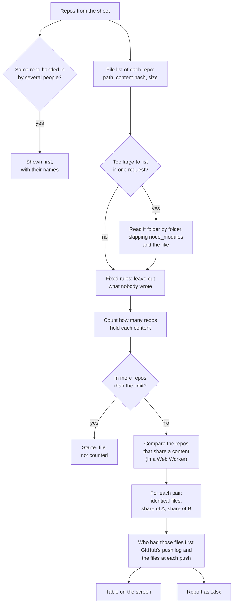
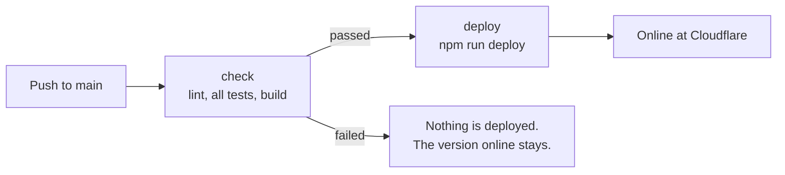
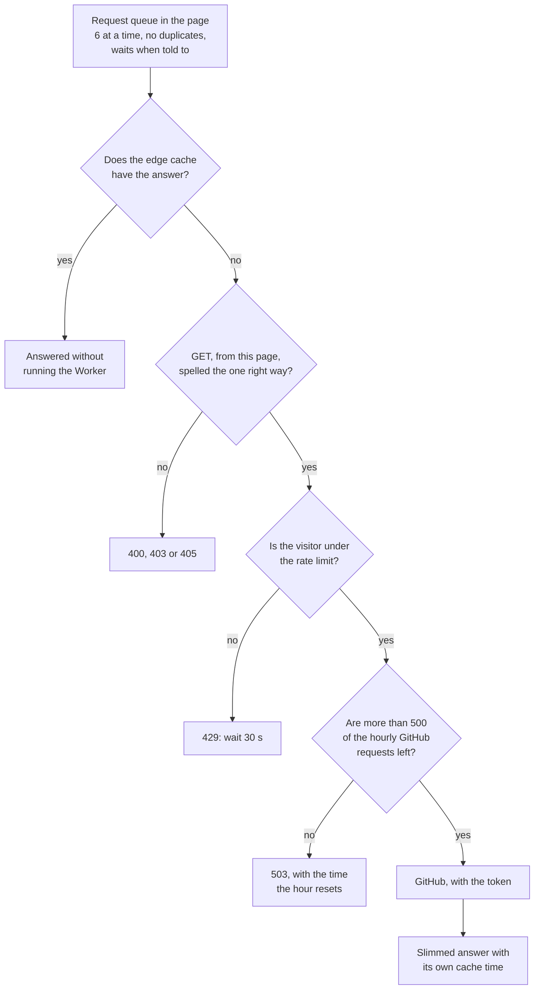

# Sir ar Last Date

A submission register for GitHub repos. Upload an Excel sheet of people and repo
links, set a deadline, and see who pushed in time, who did not, which files
changed on which date, and which repos hold identical files.

No login is needed. The sheet is read inside the browser; names and IDs are never
sent to a server. The page keeps the sheet and the deadline in this browser, so
they are still there after a reload, until **Clear** on the Register removes them.
On a shared computer, press Clear when you are done.

- [What it does](#what-it-does)
- [How it fits together](#how-it-fits-together)
- [The sheet](#the-sheet)
- [How a status is decided](#how-a-status-is-decided)
- [The similarity check](#the-similarity-check)
- [Run it on your computer](#run-it-on-your-computer)
- [Put it online](#put-it-online-cloudflare-workers-free-plan)
- [Limits and protection](#limits-and-protection)
- [The API](#the-api)
- [How it is built](#how-it-is-built)

## What it does

| Screen | What you see |
|--------|--------------|
| **Register** | One row per person: status, how late, repo created, last push, last commit, number of commits. Sort, filter by status, search, and download a results report as `.xlsx`. |
| **Person** | Open a row to see the commits grouped by date, the files each commit changed, and the deadline drawn across the timeline. |
| **Similarity** | Which people handed in the very same repo (a 100% match), which different repos hold files with exactly the same content and how much, which of the two had those files on GitHub first, and a report as `.xlsx`. |

## How it fits together

Three parts: the page in your browser, a small Worker at Cloudflare, and GitHub.
The Worker exists for one reason: to keep the GitHub token out of the browser.



What happens when a sheet is uploaded and a deadline is set:



## The sheet

Three columns, in any order. Header names are matched loosely (`Repo Link`,
`GitHub URL`, `Student ID` all work), and a column picker appears if the guess is wrong.

| id | name | repolink |
|----|------|----------|
| 22-46001-1 | Rahim Uddin | https://github.com/octocat/Hello-World |
| 22-46002-1 | Nusrat Jahan | https://github.com/octocat/Spoon-Knife |
| 22-46003-1 | Tanvir Ahmed | github.com/octocat/octocat.github.io |

`.xlsx`, `.xls` and `.csv` are accepted, up to 1,000 people and 5 MB. Repos must be public.
`demo-sheet.xlsx` in this folder is a sheet you can try.

## How a status is decided

Lateness is judged by the moment **GitHub received the push** on the repo's main
branch. Commit dates are written on the author's own computer and can be set to
anything, so they are shown only for reference.

| Status | Meaning |
|--------|---------|
| On time | Everything on the main branch reached GitHub before the deadline |
| Changed after deadline | Work was pushed in time, and more was pushed after the deadline |
| Late | Nothing had reached GitHub when the deadline passed |
| No submission | The repo exists but is empty |
| Not found | No public repo at that link (private, deleted or mistyped) |
| Invalid link | The cell does not hold a GitHub repo link |
| Check failed | GitHub could not be reached; press Refresh |

A deadline of 23:59 includes the whole minute, up to 23:59:59. Before the deadline
has passed, the wording is softer: "Submitted" and "Nothing yet". With no deadline
set, a repo with commits reads "Has work".

The rule, as it is written in `src/logic/verdict.ts`:



Open a person to see their commits grouped by date, the files each commit
changed, and the deadline drawn across the timeline. Commits that reached GitHub
after the deadline are marked, even when their own date says otherwise. Each
commit is also checked for padding (see "Check commits" under the results
report): one that changed only whitespace or no file at all is tagged, a tiny one
too, and a table above the timeline sums them up per person.

**First push** on that screen is the moment GitHub received the repo's first
push; for a fork, the first push from its owner. GitHub has kept push times only
since March 2023. When the first push is older than that, the screen shows the
date of the first commit instead and says so, because that date was written on
the author's own computer.

### The results report

**Download .xlsx** on the Register writes the rows on screen, in the order on
screen. The file opens on the Results sheet, which reads like the register
itself: the same columns in the same order, the repo by name (`octocat/Hello-World`,
clickable) and dates written as `27 Jan 2011, 01:01`. When a filter or a search
is on, the Summary says so ("3 of 15").

The file has one date more than the register: **First push**, between **Repo
created** and **Last push**. It is read from GitHub when the button is pressed,
for the repos that go into the file (one request for most repos; the toolbar
counts them), and it is the same time the person's own page shows. When GitHub
has no push time, the date of the first commit is given and marked
`(commit date)`. The notes that the register shows under a status are not in
the file.

The file also has one column the register does not: **Commits by person**, after
**Branch**. For each repo it names everyone who committed on the main branch,
with their number of commits and their share of all commits, the largest share
first: `rahim 8 (67%, 2 merges); nusrat 4 (33%)`. A person is named by their
GitHub login, or by the name written in the commit when GitHub cannot tell whose
it is, as on the person's own page. Merge commits count like any other and are
shown. The commits are read when the button is pressed, after the first pushes
(one request per 100 commits of a repo, at most ten; the toolbar counts the
repos). A repo with more than 1,000 commits is counted from its newest 1,000 and
the cell says so. When the commits could not be read, the cell says that; a repo
without work has a blank cell.

**Check commits** on the Register looks at what every commit of every repo on
screen actually changed: the newest 200 commits of each repo, one request per
commit, with a counter in the toolbar. A commit is *only whitespace* when, in
every file it touched, the removed and added lines are the same once all spaces,
tabs and blank lines are taken out; *empty* when it changed no file; *real*
otherwise, and *tiny* when real but two lines or fewer. This is judged from the
text of the changes, never from the commit message. After a check, the
**Commits by person** cell carries the counts
(`rahim 40 (67%): 12 real (5 tiny), 26 only whitespace, 2 empty`) and a number
column **Padding commits** (whitespace-only plus empty, whole repo) stands after
it, for sorting; it is blank for a repo that was not checked. A run that
GitHub's hourly limit cuts short can be started again later: what was already
read costs nothing for a week. A commit whose changes GitHub sends no text for
(a picture, a very large file) is "not checked", never padding.

| Sheet | One row per | Holds |
|-------|-------------|-------|
| Results | person | the register's columns (row, ID, name, repo, status, late by, repo created, last push, last commit, commits) with the first push between repo created and last push, then late in minutes, last on-time push, branch, commits by person and padding commits |
| Summary | status | how many people have it and their share, who needs attention, who shares a repo, the deadline and check time |
| Needs attention | late, changed, empty, missing or broken row | the most urgent first, with what to do about each |
| Same repo | repo handed in by several people | their IDs, names, sheet rows and statuses |
| Info | | how lateness is judged, what the first push, commits by person and padding commits columns hold, and what each status means |

On the Results and Needs attention sheets a person's whole row has the colour of
their status: green on time, yellow changed after the deadline, red late or
empty, grey missing, and light blue for "Has work" while no deadline is set.
Header rows are bold and stay in view while scrolling, and every column has a
filter button. Dates are real Excel dates; names are plain text, never formulas.

## The similarity check

The Similarity tab answers one question: **which repos hold files with exactly
the same content?**

Git gives every file a hash of its content. Two files with the same hash are the
same byte for byte, in any repo and under any name. So a copy is found even when
the files were renamed or moved to other folders. The page reads only file names,
hashes and sizes; it never downloads the files themselves.



### What is never compared

Two repos must not look alike only because both ran `npm install`. These are
left out before anything is counted (`src/similarity/rules.ts`):

| Left out | Examples |
|----------|----------|
| Third-party and build folders, on any level | `node_modules`, `vendor`, `venv`, `dist`, `build`, `target`, `bin`, `obj` |
| What tools write | anything starting with a dot (`.gitignore`, `.github/`, `.vscode/`), lock files, `*.config.js`, `tsconfig.json`, `*.min.js` |
| Pictures, fonts and compiled files | `png`, `jpg`, `svg`, `woff2`, `class`, `jar`, `exe`, `sqlite` |
| Almost empty files | anything under 64 bytes |

Documents and archives (`pdf`, `docx`, `zip`) are compared: an identical report
is as telling as identical code.

### Starter files

A content that many repos hold was probably handed out by the teacher or written
by a project generator. It is not counted on either side of a percentage.

"Many" is a fifth of the compared repos, but never fewer than 4 and never more
than 10. You can change the limit on the page; the result updates at once.

When a repo is left with nothing but starter files, the page says so. One or two
such repos are people who added nothing of their own. Many at once can also mean
that one solution went round: open the list of starter files, and if you see
students' own work there, raise the limit.

### Reading a pair

For a pair of repos A and B the page shows how many of A's compared files are
also in B, and the other way round. **Match** is the larger of the two shares, so
a small repo that sits completely inside a bigger one reads 100%.

| Label | When |
|-------|------|
| Same repo | one repo handed in by several people: 100%, listed first |
| Almost all identical | Match of 80% or more |
| Mostly identical | 50% or more |
| Partly identical | 20% or more |
| Small part identical | under 20% |
| Only a small file or two | fewer than 3 identical files **and** under 1 KB in total, whatever the percentage |

Open a pair to see the files: identical ones (with both paths when the copy was
renamed), files with the same name but other content, and what each rule left out.
Open a "Same repo" row to see everyone who handed it in and its files.
"Same commit in both repos" means one repo is a copy of the other's whole history.

### Who had it first

For each pair the page also looks up **which of the two repos had the shared
files on GitHub first**. It uses only what GitHub itself recorded:

- the **push log**: the moment GitHub received each push, on every branch. The
  author cannot change these times. The dates written in commits, they can.
- the **files at each pushed commit**, read from the oldest push onward until
  every shared file has been seen.

Because the pushes are read in order and on every branch, a file that was
removed and put back, or first pushed to a side branch, is still dated by the
first time it arrived.

| The column says | When |
|-----------------|------|
| A first, B first | that repo held the files more than an hour before the other one can have had them, on at least half of the shared files, and nothing in the list below speaks against it |
| Each had some first | some of the files were in A first, others in B first |
| Same source | both repos are forks of the same repo or were generated from the same template, or both contain commits that a third account wrote |
| Cannot tell | everything else; the opened pair says why |
| Open to check | a weak pair (small part identical, or only a small file or two); it is checked when you open it |

A repo is **never named as the later one** when:

- the two pushed within an hour of each other;
- GitHub's push log does not show how that repo began: it was created before
  2024 (GitHub keeps push logs only since 2023), it is a fork or a template
  copy, or its log has a gap;
- another repo of the sheet may have had the files before both;
- that repo held earlier versions of the files, while the other one received
  them complete;
- the other repo contains commits written by that repo's owner;
- the commits that brought the files to that repo are dated before the other
  repo had them. Its owner may have worked at home and pushed late. Commit
  dates are used only in this one way: to hold a result back, never to give one;
- a commit history could not be read.

One case needs no push log: a GitHub fork of the other repo. GitHub itself says
what it was copied from.

The sentence under a named result depends on the size of the match. For a pair
that is mostly or almost all identical it reads "B likely copied from A". For a
weaker match it reads "A had these files first", because a few shared files can
come from anywhere.

Open a pair to see what was observed: when each repo got the files and in how
many pushes, whether a file was worked on there before, who wrote the commits,
and what could not be seen. A repo handed in by several people has no direction
and shows a dash.

### What it cannot see

- **A copy in which every file was changed**, even by one character. The hash of
  a changed file is different. In practice a copied project keeps most files
  untouched, but a short single-file exercise can slip through.
- **A generator used by only a few people.** If three people out of thirty used
  the same project template, its files are not yet "many" and will show as
  identical. The file list of the pair makes this easy to spot.
- **Private repos**, and branches other than the main one.
- **What happened outside GitHub.** "Who had it first" knows when a file reached
  GitHub, not who wrote it. Files passed on by chat or on a stick, both people
  taking them from a third place, and a repo that was deleted and created again
  are all invisible to it. That is why a result says "likely", and why every
  doubt ends in "Cannot tell".
- **A direction between two copies of one starter repo.** Two forks of the same
  repo, or two repos made from the same template, read "Same source".
- **A file that was never at the top of a branch.** "Who had it first" reads
  the files as they stood after each push. A file that was added and removed
  again inside one push is in the repo's history but is not seen.

It is a list of places to look, not a verdict. Read the files before you decide
anything.

### The report

**Download .xlsx** on the Similarity tab writes a workbook with seven sheets.

| Sheet | One row per | Holds |
|-------|-------------|-------|
| Pairs | repo handed in by several people (first, at 100%), then pair of repos with identical files | result, match, both people and repo links, counts and shares, who had the files first |
| Who was first | pair that was checked for it | the result and what decided it, when each repo was created and got the files, how much later, files first on each side, pushes, commits, and every line of what was seen |
| Matching files | identical file | pair number, path in A, path in B, size |
| Same repo | repo handed in by several people | their IDs, names and sheet rows |
| People | row of your sheet | compared or not and why, files compared, closest match with its repo and percentage |
| Starter files | content left out as starter file | name, number of repos, size |
| Info | | when and how the report was made, and what it cannot see |

Every row of the uploaded sheet appears on the People sheet, so nobody is
silently missing. Percentages are real numbers (they sort and filter), repo
links are clickable, results are coloured, header rows stay in view, and every
column has a filter button. Names and paths are written as plain text, never as
formulas.

## Run it on your computer

Needs Node 22.22 or newer (`.nvmrc` says 22).

```sh
npm install
cp .dev.vars.example .dev.vars   # then put your GitHub token in it
npm run dev                      # http://localhost:5173
```

The token must be a **fine-grained** GitHub token with **Public repositories**
access and **no permissions**. Create one at
<https://github.com/settings/personal-access-tokens/new>. It can read nothing private.
`.dev.vars` is ignored by git; never commit a token.

```sh
npm test           # unit and screen tests
npm run coverage   # the same, with a coverage report in coverage/
npm run lint       # oxlint
npm run build      # type-check and build
```

GitHub Actions runs lint, tests and build on every push to `main` and every pull
request (`.github/workflows/ci.yml`). After a push to `main` it also puts the app
online, but only when all three passed (see the next section).

## Put it online (Cloudflare Workers, free plan)

The first time, from your computer:

```sh
npx wrangler login                     # once
npx wrangler secret put GITHUB_TOKEN   # paste the token at the prompt
npm run deploy
```

The address is `https://sir-ar-last-date.<your-subdomain>.workers.dev`.

To replace an expired token, run the `secret put` command again. Nothing else
needs to change.

### After that, a push puts it online

A push to `main` starts two jobs on GitHub, one after the other:



The `deploy` job needs two repository secrets. Add them once on GitHub, under
**Settings > Secrets and variables > Actions**:

| Secret | What to put in it |
|--------|-------------------|
| `CLOUDFLARE_API_TOKEN` | A Cloudflare API token with the **Edit Cloudflare Workers** permissions. [How to make one](https://developers.cloudflare.com/workers/ci-cd/external-cicd/github-actions/). |
| `CLOUDFLARE_ACCOUNT_ID` | The account ID that `npx wrangler whoami` prints. |

If `deploy` fails with an authentication error, the Cloudflare token has expired
or was deleted: make a new one and save it in the same secret.

Do not also connect this repo under the Worker's **Settings > Builds** in the
Cloudflare dashboard. That builds and deploys every push at Cloudflare without
waiting for the tests.

`npm run deploy` from your computer still works. It does not run the tests.

## Limits and protection

Every visitor shares one GitHub token, so each request passes several gates
before it may cost anything:



- Answers are cached at Cloudflare's edge: repo facts for 60 seconds; commits,
  changed files and file lists for a week, because a commit id never points at
  other content. Repeated checks cost nothing.
- Each visitor is limited per minute to 40 list requests (repo facts, commit
  lists), 240 detail requests (push logs, changed files) and 120 file lists.
  When a limit is reached the page waits and carries on by itself.
- "Who had it first" keeps a budget of its own inside the page: at most 200
  pushes of a repo's log, 40 older file lists per repo, 300 per comparison (120
  more for each pair you open), and three repos at a time. A pair it could not
  finish inside the budget says "Open to check".
- The app stops calling GitHub when fewer than 500 of the token's 5,000 requests
  per hour are left, so the token owner's own tools keep working. The page then
  says when to try again.
- The token never leaves the server. Other websites cannot call the API.

What things cost in GitHub requests:

| Action | Cost |
|--------|------|
| Checking a sheet of 200 people | about 10, plus one for each person who pushed after the deadline |
| Downloading the results file | one per repo whose push log the register has not read, plus one per 100 commits of each repo (at most ten) for who committed; nothing the second time |
| Check commits | one per commit, at most 200 per repo (plus one per 100 commits for a repo whose list was never read); nothing the second time within a week |
| Opening a person | one per commit, for the padding check of the newest 200 (all of them on "Check all"); the files shown are the same answers |
| Similarity, first time | one per repo; a repo too large to list at once costs a few more (never more than 41) |
| Who had it first, per repo in a stronger pair | the push log (one, two for more than 100 pushes), the commit list (one per 100 commits), and one file list per push until the shared files have been seen: one or two for a repo that got them in one go, up to 40 for one that grew slowly |
| Similarity, again | nothing, until someone pushes |

## The API

All routes are `GET` under `/api/v1`, answer JSON, and accept one exact spelling
of each query (`shared/api.ts` builds and checks it on both sides).

| Route | Query | Asks GitHub for | Visitor limit | Cached |
|-------|-------|-----------------|---------------|--------|
| `/repos` | `r=owner/name`, up to 20, sorted | facts of up to 20 repos in one GraphQL query, including the repo a fork or a template copy comes from | 40 / min | 60 s |
| `/activity` | `repo`, `v`, optional `ref`, `dir`, `after` | the push log | 240 / min | a day once settled |
| `/commits` | `repo`, `ref`, optional `after` | 100 commits behind a head commit | 40 / min | a week |
| `/commit` | `repo`, `sha`, optional `page` | the files one commit changed | 240 / min | a week |
| `/tree` | `repo`, `sha`, optional `flat=1` | the files of a repo at one commit: path, hash, size | 120 / min | a week |
| `/status` | none | how much of the hourly limit is left | 240 / min | 30 s |

Errors come as `{ "error": { "code", "message" } }`, with `retryAfter` or
`resetAt` when waiting helps.

## How it is built

```
shared/        request rules and types used by both sides
worker/        the server: talks to GitHub, caches, rate-limits
  routes/      /repos, /activity, /commits, /commit, /tree, /status
src/
  sheet/       reading the Excel file, finding columns, the results report, report colours
  logic/       the status rule, push times, sorting, dates
  similarity/  rules, file lists, the comparison, who had the files first, the report
  state/       the store and data loading
  api/         request queue with retries
  components/  the screens
```

The similarity code, file by file:

| File | Job |
|------|-----|
| `rules.ts` | which files are never compared |
| `trees.ts` | loads the file list of each repo, folder by folder when it is too large |
| `run.ts` | groups the sheet's rows by repo; keeps the reason for every row left out |
| `compare.ts` | starter files, identical files per pair, labels |
| `compare.worker.ts` | runs `compare.ts` off the main thread |
| `summary.ts` | what the screen and the report both show |
| `first.ts` | who had a shared file first: the push log's chain, when a file arrived, the rules that name a repo or say "cannot tell" |
| `history.ts` | loads a repo's push log and the files at each pushed commit, oldest first, until the shared files are seen |
| `firstRun.ts` | which pairs are checked, each repo read once, the request budget |
| `firstText.ts` | the words for it, shared by the screen and the report |
| `report.ts` | the `.xlsx` workbook |

React, TypeScript and Vite, with the Cloudflare Vite plugin. The Excel library
(SheetJS) is loaded only when a file is chosen or downloaded.

Every rule that decides something is a pure function with unit tests next to it
(`*.test.ts`), and every screen has tests that click through it in a simulated
browser (`*.test.tsx`, jsdom and Testing Library): 605 tests in 43 files. The
tests replace `fetch` with a fake API (`src/test/fakeApi.ts` for the page), so
they never call GitHub.

Not included on purpose: private repos, a login, per-person deadlines, and
storing sheets on the server.
